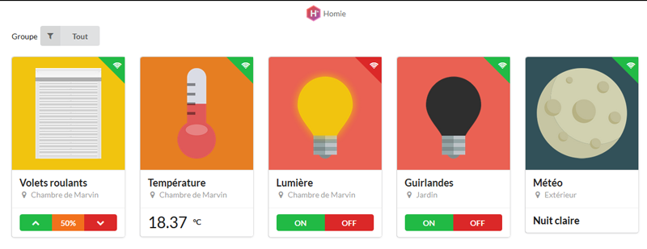

Homie server
============

[](https://www.npmjs.com/package/homie-server) [](https://travis-ci.org/marvinroger/homie-server) [](https://coveralls.io/r/marvinroger/homie-server) (broken) [](https://david-dm.org/marvinroger/homie-server) [](https://david-dm.org/marvinroger/homie-server#info=devDependencies)

Server of Homie, an opinionated home automation system using MQTT. The project is currently in alpha.



## Features

* Simple but efficient dashboard
* OTA updates

## Installation

`npm install -g homie-server`

## Usage

The Homie server can only be started using the CLI interface. Start Homie by calling `homie`. You can optionally provide a `--dataDir` argument that will be used to store the Homie data. By default, this directory is located at `<home directory>/.homie`. You can also configure the HTTP server serving the UI with `--uiPort`, else it defaults to 80.

### Configuration

Three files define the behavior of Homie, and are all contained in the data directory:

1. The `config.json` file. It will contain some configuration like for example whether you use metric or imperial units. Empty for now.

2. The `infrastructure.json` file. This file contains the representation of your Homie devices. You can also group devices there.

```json
{
  "devices": [
    {
      "id": "marvin-shutters",
      "name": "Marvin's shutters",
      "location": "Marvin's room",
      "nodes": [{
        "type": "shutters",
        "id": "shutters",
        "name": "Shutters"
      }]
    },
    {
      "id": "marvin-light",
      "name": "Marvin's light",
      "location": "Marvin's room",
      "nodes": [{
        "type": "light",
        "id": "light",
        "name": "Main light"
      }]
    },
  ],
  "groups": [
    {
      "id": "marvin",
      "name": "Marvin's room",
      "devices": ["marvin-shutters", "marvin-light"]
    }
  ]
}

```

3. The `ota/manifest.json` file. It contains a definition of the firmwares for your devices, like so:

```json
{
  "firmwares": [
    {
      "name": "Marvin_s_Room",
      "version": "1.0.0",
      "devices": ["marvin-shutters"]
    }
  ]
}
```

This manifest needs a firmware to be stored in `ota/bin/Marvin_s_Room.bin`, else OTA won't be handled. You can update the manifest while Homie is running, it will be hot-loaded.

## Contribute

Constributions are very welcome!

To work/start the git Homie version, just run `npm run dev`.
This will build the public directory, and watch for changes in the `app` folder.
To start the server, run `npm start`. The GUI will be listening on port `3000`.
